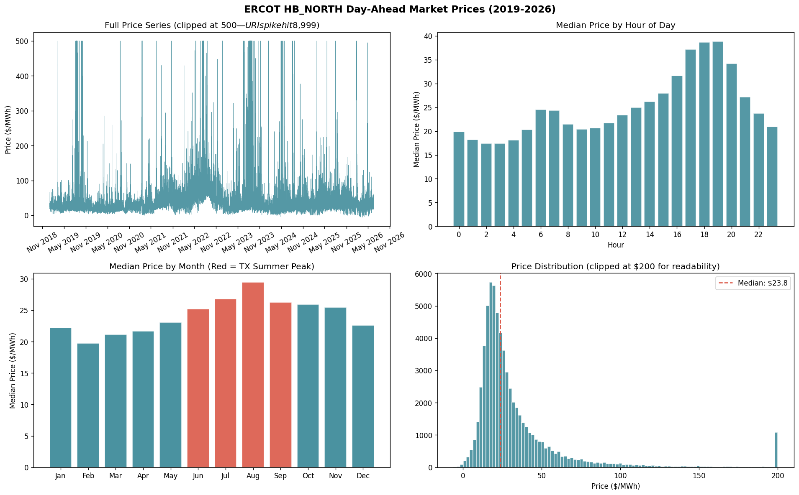
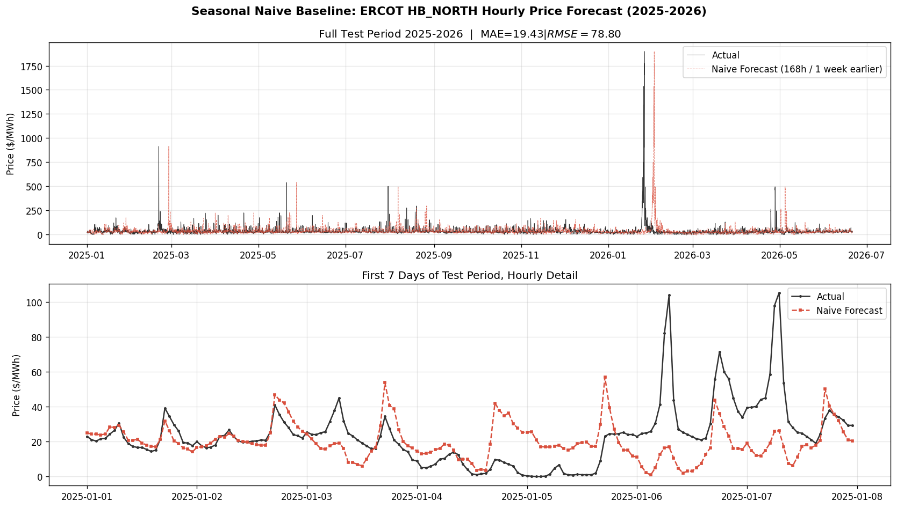
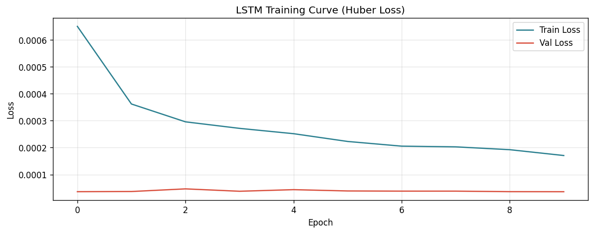
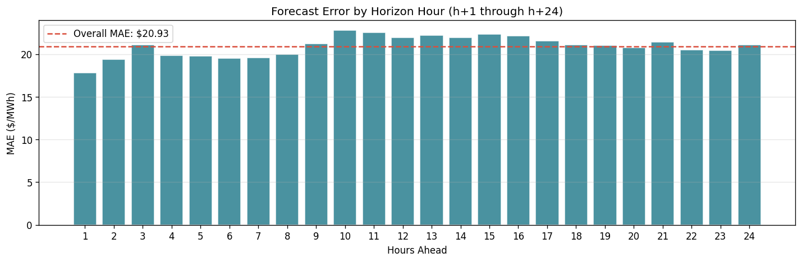
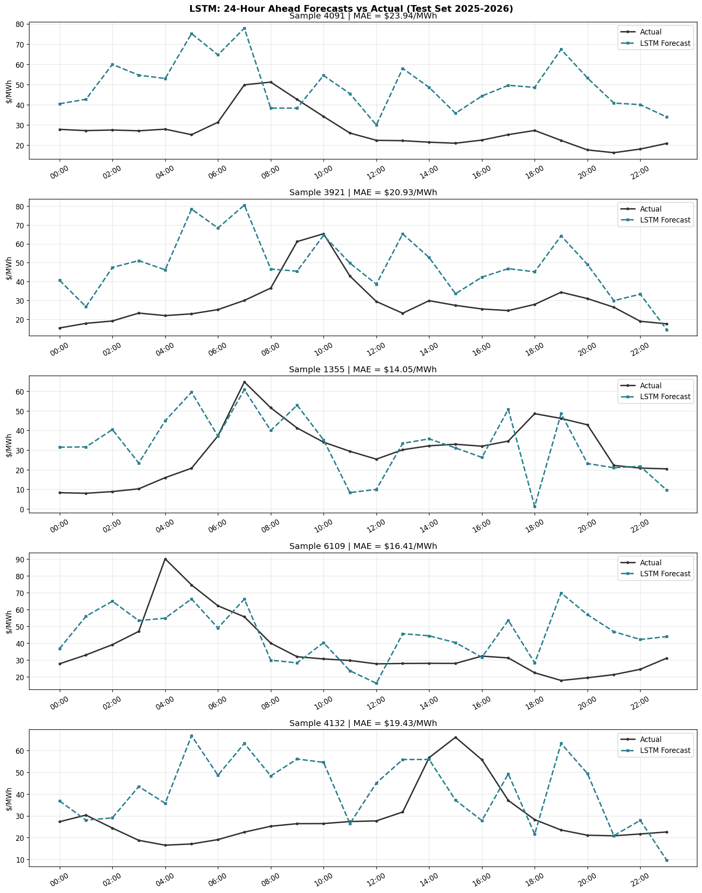

# ERCOT day-ahead Electricity price forecasting

*A data science project using real ERCOT market data, classical statistics and deep learning to forecast Texas wholesale electricity prices.*

---

## Project Snapshot

I built this project to test whether a deep learning model could beat a simple weekly baseline for ERCOT day-ahead electricity prices.

### What is ERCOT?

ERCOT (Electric Reliability Council of Texas) is the independent system operator that manages electric power across most of Texas. It operates one of the few fully deregulated electricity markets in the US, serving roughly 26 million customers and about 90% of the state's electric load.

Unlike regulated markets where utilities set prices, ERCOT runs a competitive wholesale market where prices are determined each hour by supply and demand. Generators, retailers, traders and storage operators all participate, buying and selling power based on market conditions.

**How is price data collected?**
ERCOT calculates Day-Ahead Market (DAM) Settlement Point Prices for every hour of the following day. Generators submit offers, load serving entities submit bids, and ERCOT's algorithms find the price that balances supply and demand at each grid location. Results are published publicly on ERCOT's website each day.

**Who uses this data?**
Primary users are energy traders, grid-scale battery storage operators, renewable energy developers, retail electricity providers and analytics firms building forecasting tools for the energy industry.

### The Business Problem

Battery storage operators in ERCOT use a strategy called **price arbitrage**:

- **Charge** when prices are low, typically overnight between midnight and 6am ($15-25/MWh)
- **Discharge and sell** when prices are high, typically during the evening peak between 5-8pm ($50-80/MWh)
- Profit is the spread between those two prices minus operating costs

Getting the timing right matters. Missing the evening ramp by two hours is the difference between a good day and a bad one. That is what this project works on.

---

## Exploratory Data Analysis

I pulled **ERCOT Day-Ahead Market Settlement Point Prices** for the `HB_NORTH` hub, the North Texas benchmark price used by traders and storage operators across the state.

**Source:** [ERCOT Historical DAM Load Zone and Hub Prices](https://www.ercot.com/mp/data-products/data-product-details?id=np4-180-er)

The dataset runs from **January 2019 through June 2026**, 65,464 hourly observations. A few characteristics make this market particularly difficult to model:

- **460 hours** where prices exceeded $500/MWh
- **69 hours** of negative prices. This happens when wind generation is high and demand is low, typically overnight. Wind generators sometimes pay to offload power rather than shut down because federal production tax credits make it profitable even at a negative price. ERCOT's market allows this and it shows up in the data like any other hour.
- **February 2021**: The 2021 winter storm 'Uri' caused an extreme ERCOT price event pushing prices to **$8,998.99/MWh**, nearly 200 times a typical price

Removing these hours would make the modeling problem cleaner but less useful. Storage operators care most about exactly these events.

---

## Key Findings

Running `2_eda.py` produces the following data summary:

```
OVERVIEW
  Total hours       : 65,464
  Date range        : 2019-01-01 to 2026-06-20

PRICE STATISTICS ($/MWh)
  Mean              : $54.00
  Median            : $23.75
  Std deviation     : $347.20
  Min               : $-6.00
  Max               : $8,998.99
  25th percentile   : $17.26
  75th percentile   : $36.76
  99th percentile   : $331.61

EXTREME EVENTS
  Negative hours    : 69 (0.11% of all hours)
  Hours above $100  : 2,588 (4.0% of all hours)
  Hours above $500  : 460 (0.7% of all hours)
  Feb 2021 Winter storm URI peak : $8,998.99/MWh

MEDIAN PRICE BY HOUR ($/MWh)
  Cheapest hour     : Hour 03:00  $17.38
  Most expensive    : Hour 19:00  $38.87
  Peak/off-peak gap : $21.49/MWh

MEDIAN PRICE BY MONTH ($/MWh)
  Jan: $22.23  Feb: $19.77  Mar: $21.13  Apr: $21.64
  May: $23.05  Jun: $25.20  Jul: $26.82  Aug: $29.43
  Sep: $26.27  Oct: $25.95  Nov: $25.44  Dec: $22.60

WEEKDAY vs WEEKEND
  Weekday median    : $24.16/MWh
  Weekend median    : $22.66/MWh
  Weekend discount  : $1.50/MWh

PRICE DISTRIBUTION
  Below $0 (negative)   :     69 hours (0.1%)
  $0 - $25              : 35,105 hours (53.6%)
  $25 - $50             : 20,836 hours (31.8%)
  $50 - $100            :  6,837 hours (10.4%)
  $100 - $200           :  1,546 hours (2.4%)
  Above $200            :  1,071 hours (1.6%)
```

Three things stood out.

**Hour of day matters more than expected.** Prices sit around $17/MWh between 2-4am and climb to $37-39/MWh between 5-7 pm. That is more than a 2x swing within a single day, which makes hour of the day one of the most important features in the model.

**August is consistently the most expensive month.** June through September are all elevated from air conditioning load, but August median prices hit nearly $30/MWh compared to $17-22/MWh in winter. A model without seasonal features would struggle badly on summer data.

**The market runs in two modes.** 85.4% of hours sit below $50/MWh, the routine market, predictable and consistent week to week. The other 14.6% are elevated or spike hours, more concentrated in 2022 and 2023. The regime chart below makes this visible. Any model has to deal with both modes and they behave very differently.



---

## Data Cleaning and Preparation

**Filtering to one settlement point**

The raw ERCOT files contain 15 rows per hour , one price per settlement point. Loading all of them would mix 15 different price series together. HB_NORTH (North Hub) covers the Dallas/Fort Worth region and is the most widely referenced benchmark in ERCOT trading. Filtering to HB_NORTH brought the dataset from nearly a million rows down to 65,464 - one row per hour.

**Duplicate hours**

ERCOT marks DST fall back hours with a "Repeated Hour Flag." Eight duplicate rows were dropped across the full dataset, one per year where clocks fall back.

**Missing hours**

Eight hours are missing across 7.5 years - The DST spring forward hours where clocks skip from 2am to 3am. The hour does not exist in the market so no imputation was done.

**Negative prices**

69 hours have negative prices, the lowest being -$6.00/MWh. These were kept. They are real market events and removing them would teach the model that prices never go negative, which is not true.

**The URI spike**

The February 2021 URI storm produced 460+ hours above $500/MWh. These were kept but handled carefully. For the LSTM, prices were winsorized at the 99.9th percentile ($7,556/MWh) before scaling. This is not removing the spike. It stops MinMaxScaler from compressing all normal range prices into a band so narrow the model cannot distinguish between a $20 hour and a $60 hour.

**Timestamp conversion**

ERCOT publishes prices using an hour-ending convention - "Hour Ending 01:00" means the hour from midnight to 1am. All timestamps were converted to hour starting by subtracting one hour, which is the standard convention for time series modeling.

---

## Modeling

SARIMA was the first model tried. It is a classical statistical model that works well on smooth, seasonal time series , monthly retail sales, airline passenger counts and similar. ERCOT prices are a different problem. The weekly rhythm is consistent but the same dataset also has hours where prices jump from $25 to $500 within a single day. SARIMA fits parameters to the entire series and when spikes are present those parameters get pulled toward the extremes. The result was a 2023 forecast that consistently ran $30-40/MWh above actual prices regardless of how the URI spike was handled in training. Hence, SARIMA was dropped.

---

### Model 1: Seasonal Naive Baseline

Instead of SARIMA, a simpler baseline was used: predict each hour's price as the same hour one week earlier. No training required and it works because ERCOT weekly demand patterns are consistent. Tuesday evening this week looks a lot like Tuesday evening last week.

The chart below shows how this forecast tracked actual hourly prices across the 2025-2026 test period, the same period used to evaluate the LSTM.



It follows the weekly rhythm well and stays in the right price range most of the time. Where it misses, sudden spikes is expected. It has no awareness of current market conditions, only what happened last week.

---

### Model 2: LSTM (PyTorch)

An LSTM (Long Short-Term Memory network) is a recurrent neural network built for sequential data. The naive baseline copies last week. It works for routine hours but has no awareness of what is happening right now. If prices have been climbing for three days, or a heat wave is building, or the last 48 hours look nothing like the same period last week, the naive baseline cannot respond. The LSTM sees 48 hours of recent price history and rolling statistics, giving it the context to detect when this week is shaping up differently from last week. That is where the value should come from.

**Architecture:**
```
Input  : 48-hour sliding window x 20 features
LSTM   : 2 layers, hidden size 128, dropout 0.2
FC head: 128 -> ReLU(64) -> 24
Output : next 24-hour price forecast
Parameters: 218,712
```

**Features (20 total):**
- Lagged prices: 1h, 2h, 3h, 6h, 12h, 24h, 48h, 168h
- Rolling stats: 24h mean/std, 7-day mean/std
- Cyclical time encoding: sin/cos for hour, month, day-of-week
- Calendar: is_weekend

**Why these features**

---

**Lagged prices**

| Feature | Why included |
|---|---|
| price_lag_1h | Captures immediate momentum. If the last hour was expensive the next hour often is too. |
| price_lag_2h | Same logic, extends the momentum window slightly. |
| price_lag_3h | Combined with 1h and 2h, the model gets a short-term trend direction. |
| price_lag_6h | Captures within-day patterns. Morning pricing influences afternoon pricing. |
| price_lag_12h | Half-day lookback. Connects overnight pricing to daytime patterns. |
| price_lag_24h | Same hour yesterday. Daily routines repeat: demand at 6pm today looks like demand at 6pm yesterday. |
| price_lag_48h | Same hour two days ago. Adds a second data point to confirm or contradict the 24h signal. |
| price_lag_168h | Same hour last week. The strongest predictive signal in this dataset. ERCOT weekly demand patterns are so consistent that this one feature is what the naive baseline is built on. |

---

**Rolling statistics**

| Feature | Why included |
|---|---|
| price_roll_24h_mean | Recent price level. Tells the model whether it is in a high-price or low-price period right now. |
| price_roll_24h_std | Recent volatility. A high value means the market is choppy. A low value means conditions are stable. |
| price_roll_7d_mean | Broader price regime over the past week. Smooths out daily noise to show the underlying trend. |
| price_roll_7d_std | Weekly volatility. Distinguishes a calm week from a turbulent one. |

All four use a one-step shift so the calculation only uses data available before the current hour. Without that shift you are leaking future information into training.

---

**Cyclical time encoding**

| Feature | Why included |
|---|---|
| hour_sin, hour_cos | EDA showed a $21.49/MWh gap between the cheapest (3am) and most expensive (7pm) hours. Sin/cos is used instead of raw integers because hour 23 and hour 0 are adjacent in real life but 23 apart numerically. Sin/cos preserves that adjacency. |
| month_sin, month_cos | EDA showed August running nearly $10/MWh above winter months. Same reason for sin/cos: December and January are adjacent months. |
| dow_sin, dow_cos | EDA confirmed a weekend pricing pattern. Sin/cos preserves that Sunday and Monday are neighbors. |

---

**Calendar**

| Feature | Why included |
|---|---|
| is_weekend | EDA showed a $1.50/MWh weekend discount from lower industrial and commercial demand. Small signal but real and costs one column to include. |

---


**Training choices:**
- **Huber loss** instead of MSE. With a $8,999/MWh spike in the training data, MSE would pull the model heavily toward predicting extremes.
- **Winsorized prices** at the 99.9th percentile before scaling. Without this, MinMaxScaler compresses normal range prices into a very narrow band near zero.
- **Chronological split**: 2019-2023 train, 2024 validation, 2025-2026 test. Time series data cannot be randomly shuffled without leaking future information into training.
- **Gradient clipping** at max_norm=1.0 to stabilize training on a volatile series.

---

## Results

Both models are evaluated on the same test period and the same hourly granularity: 2025-2026, the years neither model trained on. The winsorization cap and feature scaler used by the LSTM are both fit on training data only (2019-2023), fixing two earlier leakage issues where test period values were influencing the preprocessing.

| Metric | Naive Baseline | LSTM |
|---|---|---|
| MAE | $19.43/MWh | $19.43/MWh |
| RMSE | $78.80/MWh | $67.57/MWh |
| MAPE | 71.7% | 89.2% |

### What each metric measures

**MAE (Mean Absolute Error)** is the average absolute difference between predicted and actual prices across all test hours.

**RMSE (Root Mean Squared Error)** squares each error before averaging then takes the square root. Large errors are penalized much more heavily than small ones which matters during price spikes. It tells you how badly the model performs when it is really wrong.

**MAPE (Mean Absolute Percentage Error)** expresses errors as a percentage of the actual price.But it can look extreme when prices are low.

### Reading the numbers

MAE is now tied at $19.43/MWh for both models. RMSE favors the LSTM, $67.57 vs the baseline's $78.80, which means the LSTM is doing noticeably better on the large errors that come from spike hours, even though its typical hour-to-hour error matches the baseline almost exactly.

Two fixes drove this change from earlier results. The feature scaler and the price winsorization cap were both being computed on the full dataset, including 2025-2026 test period data, before the fix. That let test data leak into preprocessing decisions made on the training set. After fixing both to use training data only (2019-2023), the LSTM's numbers shifted meaningfully, in this case for the better, which is itself a sign the original leakage was working against the model rather than artificially inflating its performance.

A caveat worth being direct about: the two MAE numbers are not counting hours in exactly the same way. The naive baseline produces one independent forecast per hour, so each of the 12,862 test hours is counted once. The LSTM's evaluation uses overlapping 24-hour forecast windows, so most individual hours appear in roughly 24 different forecast windows and get averaged into the MAE multiple times. This does not invalidate the comparison, but it means the LSTM's MAE reflects performance across many overlapping predictions for the same hour rather than one prediction per hour like the baseline. A stricter comparison would de-duplicate the LSTM's predictions to one forecast per hour before computing the metric.

On the price_lag_168h feature: it is present in the model's inputs, so the claim that the LSTM cannot see last week's price at all is not accurate. But with a 48-hour lookback window and a 24-hour forecast horizon, that feature is computed once at the start of each input sequence. It directly informs the first hour of the 24-hour forecast block well, but its relevance to hour 20 or hour 24 of that same block is more indirect, since the model has to carry that information forward through its hidden state rather than seeing a fresh 168h-lag value for each forecasted hour. Extending the lookback window to 168 hours, already listed in the next section, is the more direct way to give the model that signal throughout the forecast window rather than just at the start of it.

### Training curve



The training loss is still declining by epoch 10, so more epochs may help. However, validation loss is already fairly flat, so additional training should be monitored with early stopping rather than assuming more epochs will automatically improve test performance.

### Forecast error by horizon



Error rises as the forecast looks further ahead. The first hour of the forecast has the lowest error, around $16/MWh, and error climbs through the middle of the window before reaching its highest point at h+23, around $23/MWh. This is the pattern you would expect from a sequence model: predicting one hour ahead is easier than predicting 23 hours ahead, since the model has less uncertainty to carry forward at the start of the window. It also lines up with the price_lag_168h limitation described above. That feature is most informative early in the forecast block and its influence fades as the forecast moves further from the input window.

### Sample forecasts vs actual



The forecast follows the general shape of the day but in a flattened, smoothed-out version of it. Sharp peaks get rounded off and sudden drops get missed entirely. One sample is a clear case: actual prices swing from $8 to $65 and back down over the day, while the forecast stays in a tight $25-35 band the whole time, landing an MAE of $11.25 on that sample despite missing the peak by 30+ dollars at its sharpest point. The model has learned the average behavior of a typical day rather than the specific shape of this one. That is consistent with only 10 epochs of training and a 48-hour input window that gives it limited context to react to what is actually unfolding.

---

**What is missing**

All 20 features are backward-looking: price history and time. Electricity prices are driven by current supply and demand conditions - ERCOT system load forecasts, wind and solar generation, natural gas spot prices and temperature. None of that is in this model. Adding even one external feature like the hourly ERCOT load forecast would likely improve accuracy more than any architectural change to the LSTM.

On cyclical encoding: hour of day is encoded using sine and cosine rather than raw integers. Hour 23 and hour 0 are adjacent in real life but 23 apart numerically. Sin/cos wraps the cycle so the model treats them as neighbors.

## Tuning and Next Steps

The immediate levers are training longer (30+ epochs), extending the lookback window to 168 hours so the model can actually see same-hour-last week and adding external features: ERCOT load forecasts, wind generation and natural gas futures. These three changes alone would likely close most of the gap against the naive baseline.

Beyond that: a two-stage model that handles spike hours separately from routine hours, quantile regression for prediction intervals instead of point forecasts and rolling walk-forward cross validation to get a more reliable read on how the model generalizes across different market conditions.

---

## How to Run

### Google Colab (recommended)

Colab provides a free GPU that reduces LSTM training from a few hours on local CPU to around 10 minutes.

**Step 1: Download the ERCOT data**

Go to [ERCOT Historical DAM Load Zone and Hub Prices](https://www.ercot.com/mp/data-products/data-product-details?id=np4-180-er) and download the annual xlsx files. Each file covers one full year with one tab per month. The files download as zip archives so extract them before uploading.

**Step 2: Set up your Google Drive folder**

Create this exact structure in Google Drive:

```
My Drive/
└── ercot-price-forecasting/
    ├── ercot_raw/
    │   ├── rpt...DAMLZHBSPP_2019.xlsx
    │   ├── rpt...DAMLZHBSPP_2020.xlsx
    │   ├── rpt...DAMLZHBSPP_2021.xlsx
    │   ├── rpt...DAMLZHBSPP_2022.xlsx
    │   ├── rpt...DAMLZHBSPP_2023.xlsx
    │   ├── rpt...DAMLZHBSPP_2024.xlsx
    │   ├── rpt...DAMLZHBSPP_2025.xlsx
    │   └── rpt...DAMLZHBSPP_2026.xlsx
    ├── 1_load_data.py
    ├── 2_eda.py
    ├── 3_features.py
    ├── 4_sarima.py
    ├── 5_lstm.py
    └── requirements.txt
```

**Step 3: Open a new notebook at [colab.research.google.com](https://colab.research.google.com) and run these cells in order:**

```python
# Cell 1: Mount Google Drive
from google.colab import drive
drive.mount('/content/drive')
```

```python
# Cell 2: Navigate to project folder
import os
os.chdir('/content/drive/MyDrive/ercot-price-forecasting')
os.listdir()
```

```python
# Cell 3: Install dependencies
!pip install -r requirements.txt -q
```

```python
# Cell 4: Run scripts in order
!python 1_load_data.py
!python 2_eda.py
!python 3_features.py
!python 4_sarima.py
!python 5_lstm.py
```

**Step 4: View charts inline**

```python
from IPython.display import Image
Image('ercot_eda.png')          # after 2_eda.py
Image('baseline_forecast.png')  # after 4_sarima.py
Image('lstm_24h_forecasts.png') # after 5_lstm.py
```

Each script saves output back to your Drive folder so results persist between sessions.

---
