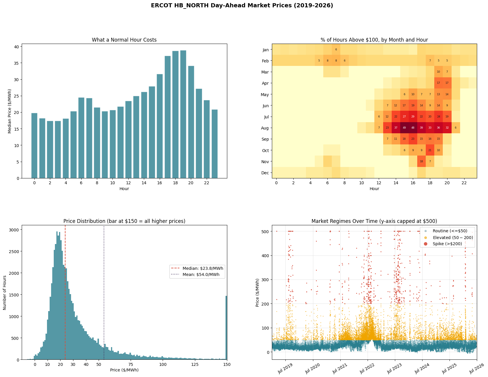
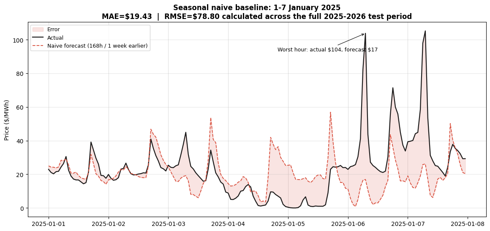
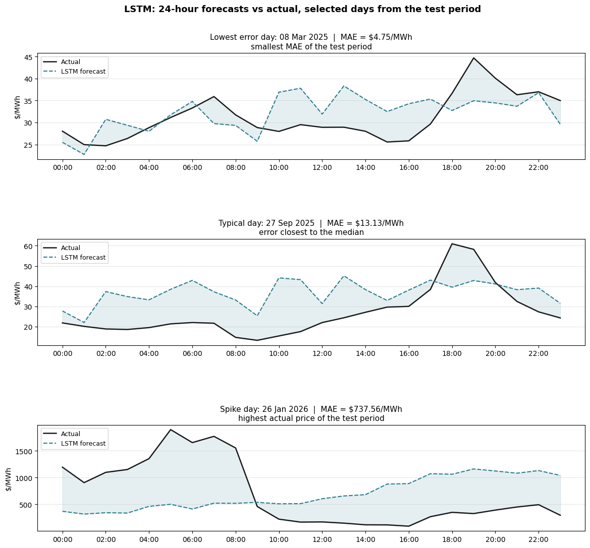
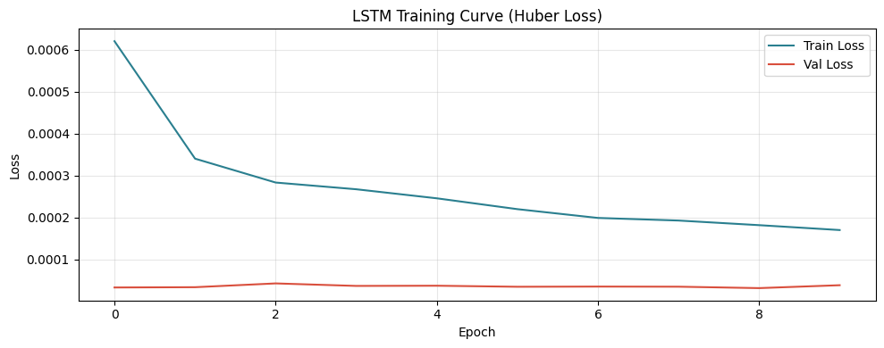
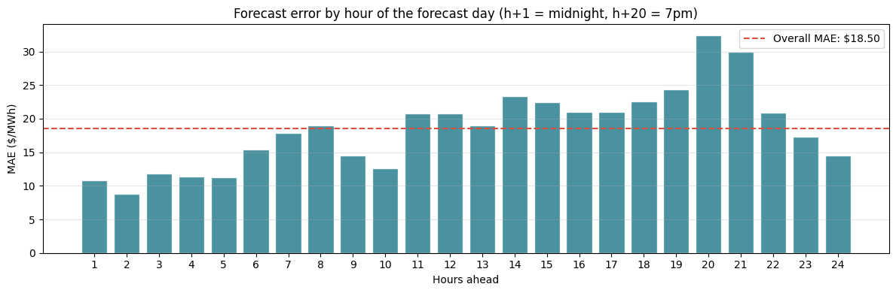

# ERCOT Day-Ahead Electricity Price Forecasting

*A data science project using real ERCOT market data, classical statistics and deep learning to forecast Texas wholesale electricity prices.*

---

## Project Snapshot

I built this project to test whether a deep learning model could beat a simple weekly baseline for ERCOT day-ahead electricity prices.

### What is ERCOT?

ERCOT (Electric Reliability Council of Texas) is the independent system operator that manages electric power across most of Texas. It operates one of the few fully deregulated electricity markets in the US, serving roughly 26 million customers and about 90% of the state's electric load.

Unlike regulated markets where utilities set prices, ERCOT runs a competitive wholesale market where prices are determined each hour by supply and demand. Generators, retailers, traders and storage operators all participate, buying and selling power based on market conditions.

**How is price data collected?**
ERCOT calculates Day-Ahead Market (DAM) Settlement Point Prices for every hour of the following day. Generators submit offers (Wind farm, solar farm, Battery), load serving entities (Retail electric providers) submit bids, and ERCOT's algorithms find the price that balances supply and demand at each grid location. Results are published publicly on ERCOT's website each day.

| Step | What happens | Generator (Seller) | LSE (Buyer) | ERCOT |
|---|---|---|---|---|
| **1. Submit offers/bids** | Participants submit prices | Offers **500 MW @ $40/MWh** | Bids for **500 MW @ $60/MWh** | Receives both |
| **2. Match supply & demand** | ERCOT finds compatible supply/demand | Will sell at **$40 or higher** | Will buy at **$60 or lower** | **Trade can clear** because $40 ≤ $60 |

**Who uses this data?**
Primary users are energy traders, grid-scale battery storage operators, renewable energy developers, retail electricity providers and analytics firms building forecasting tools for the energy industry.

### The Business Problem

Battery storage operators in ERCOT use a strategy called **price arbitrage**:

- **Charge** when prices are low, typically overnight between 2am and 5am (median $17-18/MWh)
- **Discharge and sell** when prices are high, typically during the evening peak between 5-8pm (median $37-39/MWh)
- Profit is the spread between those two prices minus operating costs

On a typical day that spread is around $21/MWh. The larger opportunities are on the minority of days when prices break well above the median, and those cluster in the summer afternoon rather than the evening. The EDA section covers this. Getting the timing right matters. That is what this project works on.

---

## Exploratory Data Analysis
ERCOT runs two markets. The real-time market settles every five minutes based on what's actually happening on the grid right now. The day-ahead market is a forward auction held once per day for the following day's 24 hours. Generators / sellers submit offers (Wind farm, solar farm, Battery), load serving entities / Buyers (Retail electric providers) submit bids and ERCOT clears all 24 hours at once. 

I pulled **ERCOT Day-Ahead Market Settlement Point Prices** for the `HB_NORTH` hub, the North Texas benchmark price used by traders and storage operators across the state.

**Source:** [ERCOT Historical DAM Load Zone and Hub Prices](https://www.ercot.com/mp/data-products/data-product-details?id=np4-180-er)

The dataset runs from **January 2019 through June 2026**, 65,464 hourly observations. A few characteristics make this market particularly difficult to model:

- **460 hours** where prices exceeded $500/MWh
- **69 hours** of negative prices and 63 of them are in 2026. There were none at all from 2019 through 2023. They cluster between 9am and 3pm in February through May, which points to mild spring days with strong midday generation and not enough demand to absorb it.
  
- **February 2021**: The 2021 winter storm 'Uri' caused an extreme ERCOT price event pushing prices to **$8,998.99/MWh**, nearly 200 times a typical price

Removing these hours would make the modeling problem cleaner but less useful. Storage operators care most about exactly these events.

---

## Key Findings

Running `2_eda.py` produces the following data summary:

```
OVERVIEW
  Total hours       : 65,464
  Date range        : 2019-01-01 to 2026-06-20

PRICE STATISTICS ($/MWh)
  Mean              : $54.00
  Median            : $23.75
  Std deviation     : $347.20
  Min               : $-6.00
  Max               : $8,998.99
  25th percentile   : $17.26
  75th percentile   : $36.76
  99th percentile   : $331.61

EXTREME EVENTS
  Negative hours    : 69 (0.11% of all hours)
  Hours above $100  : 2,588 (4.0% of all hours)
  Hours above $500  : 460 (0.7% of all hours)
  Feb 2021 Winter storm URI peak : $8,998.99/MWh

MEDIAN PRICE BY HOUR ($/MWh)
  Cheapest hour     : Hour 03:00  $17.38
  Most expensive    : Hour 19:00  $38.87
  Peak/off-peak gap : $21.49/MWh

MEDIAN PRICE BY MONTH ($/MWh)
  Jan: $22.23  Feb: $19.77  Mar: $21.13  Apr: $21.64
  May: $23.05  Jun: $25.20  Jul: $26.82  Aug: $29.43
  Sep: $26.27  Oct: $25.95  Nov: $25.44  Dec: $22.60

WEEKDAY vs WEEKEND
  Weekday median    : $24.16/MWh
  Weekend median    : $22.66/MWh
  Weekend discount  : $1.50/MWh

PRICE DISTRIBUTION
  Below $0 (negative)   :     69 hours (0.1%)
  $0 - $25              : 35,105 hours (53.6%)
  $25 - $50             : 20,836 hours (31.8%)
  $50 - $100            :  6,837 hours (10.4%)
  $100 - $200           :  1,546 hours (2.4%)
  Above $200            :  1,071 hours (1.6%)
```



Analysis:


- **Hour of day matters more than expected.** *(Chart 1: What a Normal Hour Costs)* Prices sit around $17/MWh between 2-4am and climb to $37-39/MWh between 5-7pm. That is more than a 2x swing within a single day.

- **The expensive hour and the spike hour are not the same hour.** *(Charts 1 and 2 together)* The median peaks at 7pm but the share of hours above $100 peaks at 3pm
    - which hour costs most on a typical day?: 7 PM
    - which hour is most likely to break $100? In August, 3pm does that 49% of the time. 6pm only 33%. So 3pm is less expensive on an ordinary day but goes extreme far           more often.


- **Summer and winter have opposite daily shapes.** *(Chart 2: % of Hours Above $100, by Month and Hour)* August spike risk peaks at 3pm. February February's highest cell reaches 8% at 7am and its afternoon and evening cells sit at similar levels. There is no single daily price shape to learn. The daily price pattern changes with the season. In summer, prices are most likely to break $100 in the afternoon. In winter, in the early morning. A model with a single set of hour-of-day features has to represent both with the same parameters.

- **The market runs in two modes.** *(Charts 3 and 4: Price Distribution, Market Regimes Over Time)* 85.6% of hours sit below $50/MWh, the routine market, predictable week to week. The other 14.4% are elevated or spike hours. Any model has to deal with both routine and spike hours and tuning for one costs the accuracy on other. Getting the routine ones right tends to mean smoothing away exactly the spikes that matter most
  
- The mean price is $54/MWh and the median is $23.75. Across a full year of 8,760 hours:

    - Mean: 8,760 × $54 = about $473,000
    - Median: 8,760 × $23.75 = about $208,000
    - Gap: about $265,000

The median is what you would estimate a year costs by looking at a typical hour. The mean is what a year actually costs. The difference is the spike hours, and the mean is the closer figure for a battery operator, because revenue is a sum and the sum is driven by those hours.

Overall, The EDA points in two directions. The weekly and daily cycles are strong and consistent, which favors a classical time series model. Spikes follow no schedule at all & no amount of seasonal structure will capture them. The approach was therefore to start simple and add complexity only where it demonstrably improved results. A classical statistical model first then a seasonal naive baseline to establish a floor, then a neural network. If the neural network could not outperform a rule as simple as repeating the previous week, the additional complexity would not be justified.

---

## Data Cleaning and Preparation

**Filtering to one settlement point**

The raw ERCOT files contain 15 rows per hour , one price per settlement point. Loading all of them would mix 15 different price series together. HB_NORTH (North Hub) covers the Dallas/Fort Worth region and is the most widely referenced benchmark in ERCOT trading. Filtering to HB_NORTH brought the dataset from nearly a million rows down to 65,464 - one row per hour.

**Duplicate hours**

ERCOT marks DST fall back hours with a "Repeated Hour Flag." Eight duplicate rows were dropped across the full dataset, one per year where clocks fall back.

**Missing hours**

Eight hours are missing across 7.5 years - The DST spring forward hours where clocks skip from 2am to 3am. The hour does not exist in the market so no imputation was done.

**Negative prices**

69 hours have negative prices, the lowest being -$6.00/MWh. These were kept. They are real market events and removing them would teach the model that prices never go negative, which is not true.

**The URI spike**

The February 2021 URI storm produced 460+ hours above $500/MWh. These were kept but handled carefully. For the LSTM, prices were winsorized at the 99.9th percentile ($7,556/MWh) before scaling. This is not removing the spike. It stops MinMaxScaler from compressing all normal range prices into a band so narrow the model cannot distinguish between a $20 hour and a $60 hour.

**Timestamp conversion**

ERCOT publishes prices using an hour-ending convention - "Hour Ending 01:00" means the hour from midnight to 1am. All timestamps were converted to hour starting by subtracting one hour, which is the standard convention for time series modeling.

---

## Modeling

### First attempt: SARIMA
SARIMA was the first model tried. It is a classical statistical model that works well on smooth, seasonal time series data such as monthly retail sales, airline passenger counts and similar. ERCOT prices are a different problem. The weekly rhythm is consistent but the same dataset also has hours where prices jump from $25 to $500 within a single day. SARIMA fits parameters to the entire series and when spikes are present those parameters get pulled toward the extremes. The result was a 2023 forecast that consistently ran $30-40/MWh above actual prices regardless of how the URI spike was handled in training. Hence, SARIMA was dropped.

---

### Model 1: Seasonal Naive Baseline

Instead of SARIMA, a simpler baseline was used: predict each hour's price as the same hour one week earlier. 

**Method**

    ŷ(t) = y(t − 168)

The forecast for hour *t* is the actual price 168 hours earlier, exactly one week. This preserves both hour of day and day of week.

**Data used: January 2025 to June 2026**

There is no training step. The forecast for any hour is the price from the same hour one week earlier, so the method needs no fitted parameters and no training window.It only needs the previous week of actual prices at prediction time.ERCOT weekly demand patterns are consistent. Tuesday evening this week looks a lot like Tuesday evening last week.

**Analysis**

The chart below zooms into a single week, 1 to 7 January 2025.



**What the chart shows**

The first week of the test period, with the shaded band representing the error between forecast and actual.

The method performs well for the first two days. The previous Wednesday closely resembled this Wednesday, and the error band remains narrow.

Performance then deteriorates sharply. On 4 and 5 January the forecast predicts $20-42 against actual prices near $1. On 6 January it predicts $17 against an actual of $104. The same method, within the same week, four days apart.

This is the limitation of the approach stated directly. It has no awareness of current market conditions, only of what occurred seven days earlier. Where this week resembles last week it is difficult to beat. Where it does not, the method has no mechanism to detect the difference.

The metrics MAE and RMSE are calculated across the entire test period, January 2025 through June 2026, roughly 12,800 hours. We later evaluate the LSTM model on that same test period. That shared test window is what makes the two sets of metrics comparable, with one caveat about how the hours are counted, covered in the results section.

Baseline Results (Test: 2025-2026, hourly)
```
---------------------------------------------
Method: Seasonal Naive (same hour, 1 week earlier)
Mean Absolute Error (MAE) : $19.43/MWh
Mean Squared Error (RMSE): $78.80/MWh
Mean Absolute Percentage Error (MAPE): 71.7%
---------------------------------------------
```
---

### Model 2: LSTM (PyTorch)

An LSTM (Long Short-Term Memory network) is a recurrent neural network built for sequential data. The naive baseline copies last week. It works for routine hours but has no awareness of current conditions. If prices have been climbing for three days, or the last 48 hours look nothing like the same period a week earlier, the baseline cannot respond.

The LSTM sees 48 hours of recent price history and rolling statistics, which should give it the context to detect when this week is developing differently from last week. Whether that context is sufficient is the question the results section answers.That is where the value should come from.

**Architecture:**
```
Input      : 48-hour sliding window x 20 features
LSTM       : 2 layers, hidden size 128, dropout 0.2
FC head    : 128 -> ReLU(64) -> 24
Output     : next 24-hour price forecast
Parameters : 218,712
Training   : 43,580 overlapping samples, 2019-2023
Evaluation : 534 daily forecasts, each starting at midnight, 2025-2026
```

**Features (20 total):**
- Lagged prices: 1h, 2h, 3h, 6h, 12h, 24h, 48h, 168h
- Rolling stats: 24h mean/std, 7-day mean/std
- Cyclical time encoding: sin/cos for hour, month, day-of-week
- Calendar: is_weekend

**How the data is shaped**

The baseline takes the price from 168 hours ago.The LSTM has no such rule. It is given examples and left to work out the mapping itself.
Each position produces one training sample. The input is not one number per hour. Each hour is a row of 20 features, so a single sample looks like this:

    INPUT: hours 1-48, 48 rows x 20 columns (drawn from 2019-2023 training data)
    ┌──────────────────────────────────────────────────────────────── ┐
    │ hour   price   hour_sin   hour_cos   lag_1h   ...   roll_7d_mean│
    │   1    15.54      0.000      1.000    18.49   ...          25.67│
    │   2    15.31      0.259      0.966    15.54   ...          25.64│
    │   3    15.46      0.500      0.866    15.31   ...          25.61│
    │  ...                                                            │
    │  48    20.79     -0.259      0.966    22.02   ...          23.60│
    └──────────────────────────────────────────────────────────────── ┘
```text
Sample 1
INPUT : hours  1-48   (48 rows x 20 features)
OUTPUT: hours 49-72   (24 prices)

hour     49     50     51     52    ...     72
price  17.60  17.22  16.88  17.51   ...  16.71


Sample 2
INPUT : hours  2-49
OUTPUT: hours 50-73

hour     50     51     52     53    ...     73
price  17.22  16.88  17.51  18.32   ...  15.76
```

The output is prices only, one per hour for the next 24 hours. The 2019-2023 training period yields 43,651 hourly rows. The last 71 cannot start a sample, since each needs 48 hours of history plus the 24 that followed, so training runs on 43,580 samples. 

Training adjusts the model's weights until its 24 output numbers sit as close as possible to the 24 hours that actually happened

**Why these features**

---

**Lagged prices**

| Feature | Why included |
|---|---|
| price_lag_1h | Captures immediate momentum. If the last hour was expensive the next hour often is too. |
| price_lag_2h | Same logic, extends the momentum window slightly. |
| price_lag_3h | Combined with 1h and 2h, the model gets a short-term trend direction. |
| price_lag_6h | Captures within-day patterns. Morning pricing influences afternoon pricing. |
| price_lag_12h | Half-day lookback. Connects overnight pricing to daytime patterns. |
| price_lag_24h | Same hour yesterday. Daily routines repeat: demand at 6pm today looks like demand at 6pm yesterday. |
| price_lag_48h | Same hour two days ago. Adds a second data point to confirm or contradict the 24h signal. |
| price_lag_168h | Same hour last week. The strongest predictive signal in this dataset. ERCOT weekly demand patterns are so consistent that this one feature is what the naive baseline is built on. |

---

**Rolling statistics**

| Features | Why included |
|---|---|
| `price_roll_24h_mean`, `price_roll_24h_std` | Recent price level and volatility. Whether the market is high or low right now, and whether it is choppy or stable. |
| `price_roll_7d_mean`, `price_roll_7d_std` | Smooths daily noise to show the underlying regime, and distinguishes a calm week from a turbulent one. |

All four use a one-step shift, so the calculation only uses data available before the current hour. Without that shift, future information leaks into training.

---

**Cyclical time and calendar features**
---
One limitation. Hour and month enter as separate features, so the model can learn that afternoons are expensive and that August is expensive, but not that afternoons are expensive *specifically* in August. The EDA found exactly that pattern: August spike risk peaks at 3pm, February's at 7am. 

| Features | Why included |
|---|---|
| `hour_sin`, `hour_cos` | A $21.49/MWh gap between the cheapest hour (3am) and the most expensive (7pm) — the largest single pattern in the data. Sin/cos is used instead of raw integers because hour 23 and hour 0 are adjacent in real life but 23 apart numerically. |
| `month_sin`, `month_cos` | Not the median price level, which barely moves across the year, but the spike concentration: 13.1% of August hours clear $100 against 1.3% in March. This is also the only channel for seasonal information, since a 48-hour input window contains no clue as to the time of year. |
| `dow_sin`, `dow_cos`, `is_weekend` | A $1.50/MWh weekend discount from lower industrial demand. A small signal, well below the model's error, and these three columns may not be earning their place. |

Sin/cos encoding applies throughout for the same reason: December and January are adjacent months, Sunday and Monday are adjacent days.

---

**Training choices:**
- **Huber loss** instead of MSE. With a $8,999/MWh spike in the training data, MSE would pull the model heavily toward predicting extremes.
- **Winsorized prices** at the 99.9th percentile before scaling. Without this, MinMaxScaler compresses normal range prices into a very narrow band near zero.
- **Chronological split**: 2019-2023 train, 2024 validation, 2025-2026 test. Time series data cannot be randomly shuffled without leaking future information into training.
- **Gradient clipping** at max_norm=1.0 to stabilize training on a volatile series.

---

## Results

Both models are evaluated on the same 534 days, January 2025 to June 2026, and each test hour is scored exactly once. The winsorization cap and feature scaler used by the LSTM are both fit on training data only (2019-2023).

- **MAE (Mean Absolute Error)** is the average absolute difference between predicted and actual prices across all test hours.
- **RMSE (Root Mean Squared Error)** squares each error before averaging then takes the square root. Large errors are penalized much more heavily than small ones which matters during price spikes. It tells you how badly the model performs when it is really wrong.
- **MAPE (Mean Absolute Percentage Error)** expresses errors as a percentage of the actual price.But it can look extreme when prices are low.


| Metric | Seasonal naive | LSTM | Change |
|---|---|---|---|
| MAE | $19.43/MWh | $18.50/MWh | 4.8% better |
| RMSE | $78.80/MWh | $55.82/MWh | 29.2% better |

Note: MAPE has been removed since is generally a poor choice for wholesale electricity-price forecasting

### Comparing LSTM Sample forecasts vs actual

Each panel reports MAE, which on a single day means the average miss across those 24 hours, in dollars. RMSE over 24 hours would be dominated by one or two bad hours rather than describing the day. Modified MAPE would be misleading in the other direction, since it is most sensitive to cheap hours.



Three days, chosen automatically: the lowest-error day, the day whose error is closest to the median, and the day with the highest actual price.

On 8 March 2025 the MAE is $4.75, the smallest of the test period. But the forecast zigzags while the actual price moves smoothly. It scores well because prices stayed within a $25-45 band all day. Small error, but lacks not accurate tracking.

On 27 September 2025 sits at $13.13. The forecast is above actual for almost the entire day and misses the evening peak, predicting $43 against an actual of $61.

On 26 January 2026 is the highest-priced day in the test set. Actual prices run $1,200 to $1,875 overnight, then collapse to around $130 by mid-afternoon. The forecast does close to the opposite: roughly $350 during the actual peak, rising to $1,150 in the afternoon once prices have already fallen. MAE for the day is $737.That day is also the model's worst. The failure is not distributed evenly across the test period; it concentrates on exactly the day with the most money at stake.

### NOTE
The feature scaler and the winsorization cap were originally computed on the full dataset, including the 2025-2026 test period, which let test data influence preprocessing decisions applied to the training set. Both now fit on training data only. The LSTM's metrics improved after the fix, which suggests the leakage had been working against the model rather than flattering it.

On `price_lag_168h`: the feature is in the model's inputs, so the claim that the LSTM learn last week's price. 

### Training curve



The training loss is still declining by epoch 10, so more epochs may help. Validation loss is flat and sits below training loss throughout.The usual rule is: train until validation loss stops falling, then stop. That assumes validation loss reflects how well the model is learning. Here it may not. The red line is flat, but is  therefore stop isn't a safe conclusion.

### Forecast error by horizon



Error rises as the forecast looks further ahead. The first hour of the forecast has the lowest error, around $16/MWh, and error climbs through the middle of the window before reaching its highest point at h+23, around $23/MWh. This is the pattern you would expect from a sequence model: predicting one hour ahead is easier than predicting 23 hours ahead, since the model has less uncertainty to carry forward at the start of the window. It also lines up with the price_lag_168h limitation described above. That feature is most informative early in the forecast block and its influence fades as the forecast moves further from the input window.

---


## Limitations and Next Steps

The model uses only historical prices and calendar encodings. It has no view of the grid: no ERCOT load forecast, no wind or solar generation, no gas prices, no temperature. A model that cannot see reserve margins or a load forecast has no way to anticipate a scarcity event, so it settles on the average. Adding external features such as ERCOT load forecasts, wind generation and natural gas prices would likely narrow the gap against the weekly seasonal naive baseline.

                     ERCOT / MARKET DATA
                           │
          ┌────────────────┼─────────────────┐
          │                │                 │
    Historical Price   ERCOT Load       Wind / Solar
          │             Forecast          Forecast
          │                │                 │
          └────────────────┼─────────────────┘
                           │
                    Feature Engineering
                           │
                    Price Forecast Model
                           │
                     ERCOT Price
                           │
                  Battery Optimizer
                           │
                    Revenue / Profit

Beyond external features: a two-stage model separating spike hours from routine hours, quantile regression to predict a range rather than a point, and a battery dispatch backtest that scores captured spread against perfect foresight rather than average error.

---

## How to Run

### Google Colab (recommended)

Colab provides a free GPU that reduces LSTM training from a few hours on local CPU to around 10 minutes.

**Step 1: Download the ERCOT data**

Go to [ERCOT Historical DAM Load Zone and Hub Prices](https://www.ercot.com/mp/data-products/data-product-details?id=np4-180-er) and download the annual xlsx files. Each file covers one full year with one tab per month. The files download as zip archives so extract them before uploading.

**Step 2: Set up your Google Drive folder**

Create this exact structure in Google Drive:

```
My Drive/
└── ercot-price-forecasting/
    ├── ercot_raw/
    │   ├── rpt...DAMLZHBSPP_2019.xlsx
    │   ├── rpt...DAMLZHBSPP_2020.xlsx
    │   ├── rpt...DAMLZHBSPP_2021.xlsx
    │   ├── rpt...DAMLZHBSPP_2022.xlsx
    │   ├── rpt...DAMLZHBSPP_2023.xlsx
    │   ├── rpt...DAMLZHBSPP_2024.xlsx
    │   ├── rpt...DAMLZHBSPP_2025.xlsx
    │   └── rpt...DAMLZHBSPP_2026.xlsx
    ├── 1_load_data.py
    ├── 2_eda.py
    ├── 3_features.py
    ├── 4_sarima.py
    ├── 5_lstm.py
    └── requirements.txt
```

**Step 3: Open a new notebook at [colab.research.google.com](https://colab.research.google.com) and run these cells in order:**

```python
# Cell 1: Mount Google Drive
from google.colab import drive
drive.mount('/content/drive')
```

```python
# Cell 2: Navigate to project folder
import os
os.chdir('/content/drive/MyDrive/ercot-price-forecasting')
os.listdir()
```

```python
# Cell 3: Install dependencies
!pip install -r requirements.txt -q
```

```python
# Cell 4: Run scripts in order
!python 1_load_data.py
!python 2_eda.py
!python 3_features.py
!python 4_sarima.py
!python 5_lstm.py
```

**Step 4: View charts inline**

```python
from IPython.display import Image
Image('ercot_eda.png')          # after 2_eda.py
Image('baseline_forecast.png')  # after 4_sarima.py
Image('lstm_24h_forecasts.png') # after 5_lstm.py
```

Each script saves output back to your Drive folder so results persist between sessions.

---
